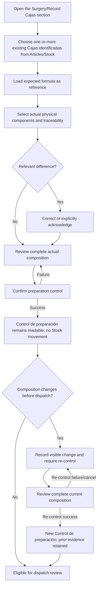
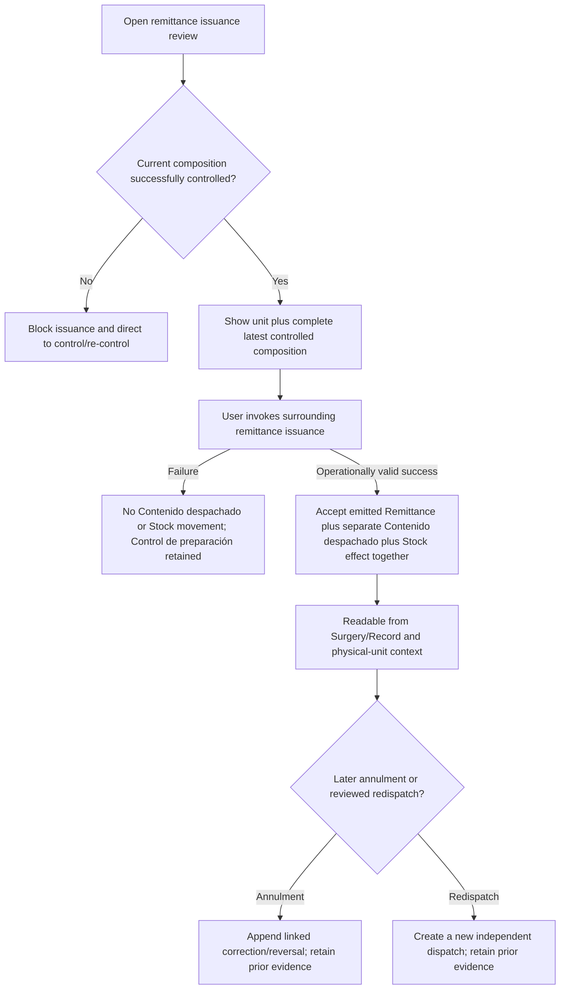
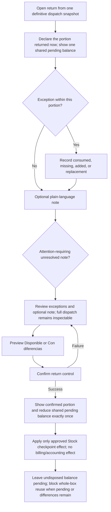

# DESIGN — CAJAS-UX-SDD-PROPOSAL-001

Status: **amended with approved DG-01–DG-07 and CD-01–CD-10; ready for independent verification**
Change: `CAJAS-UX-SDD-PROPOSAL-001`
Language: English
Sources: Franco-approved `PROPOSAL.md`; synchronized `SPEC.md`; Franco-approved DG-01–DG-07 decisions in Engram #2816, #2817, #2824, #2826, #2827, #2828, #2836, with aggregate closure #2837; Franco-approved `DECISIONS-CD01-CD10.md` addendum dated 2026-07-20
Artifact chain: PROPOSAL → SPEC → **DESIGN** → TASKS → APPLY

---

## 1. Design purpose

This artifact translates the approved Cajas V1 behavior into information architecture, interaction structure, screen anatomy, conceptual frontend state, and reusable UI boundaries. It is intentionally implementation-neutral.

The design keeps `/cajas` as a search and summary view, not the primary operational host. Articles/Stock administers the shared `Caja` definition, `Contenido esperado`, and each `Caja identificada`. A dedicated `Cajas` section in the Surgery/Record hosts selection, preparation, control, explicit re-control, dispatch, and return in operation context; Remittance and Return reuse their existing contextual flows. The design does not create a Box-only catalog or a parallel operation record.

This artifact defines no schema, persistence model, API contract, route contract, Auth role mapping, transaction mechanism, migration, source-code structure, or sensitive Surgery/Record refactor. It describes the approved capability and Stock checkpoint behavior conceptually; any future implementation remains separately approval-gated and must satisfy the approved atomic, audited, and idempotent effect boundary.

## 2. Evidence and current-surface audit

The current prototype provides useful visual conventions: compact page headers, cards, search/filter controls, dense tables, badges, dialogs, and responsive horizontal inspection. Its current `/cajas` mock, however, presents each row as a surgery-linked box with lifecycle-like states and mutable contents. That model is not used as a product authority here because it does not preserve the required distinctions among Box SKU, physical unit, expected formula, selected composition, controlled snapshot, and definitive dispatch snapshot.

Design implications:

- retain the product's compact, operational density and familiar table/card patterns;
- replace lifecycle KPI concepts with summaries using the approved current-condition labels `Disponible` and `Con diferencias` without presenting them as a complete lifecycle state machine;
- search both shared SKU identity and physical-unit code while preserving their parent-child relationship;
- expose operation evidence through contextual links rather than making `/cajas` own Surgery/Record execution;
- host O1–O4 in the dedicated Surgery/Record `Cajas` section while preserving Remittance and Return as contextualized existing flows;
- make snapshots readable and immutable-looking, not editable content tables; and
- make exception entry the primary return interaction rather than asking users to re-enter all contents.

This is a design direction only. It creates no legacy-code migration or preservation commitment.

## 3. Locked design principles

### 3.1 Approved vocabulary across three contexts

The experience uses three visibly different contexts:

1. **Article definition context** — the compound SKU `Caja` and its versioned `Contenido esperado`.
2. **Physical stock context** — each uniquely identified physical exemplar, labeled `Caja identificada`, plus selectable physical components with applicable traceability.
3. **Operation evidence context** — actual selection, historical `Control de preparación` records, each dispatch's immutable `Contenido despachado`, return exceptions, and simple notes for one Surgery/Record.

No context may visually masquerade as another. Section titles, context eyebrows, read-only treatments, and checkpoint labels carry meaning in addition to color. This implements `SCOPE-01`, `SCOPE-03`, and `VOCAB-01`–`VOCAB-04`.

### 3.2 Daily work is exception-driven

Defaults reduce repeated entry:

- the expected formula seeds the preparation comparison;
- matching lines need physical selection but no difference explanation;
- only relevant differences require correction or explicit acknowledgement;
- return starts with every dispatched line treated as unchanged; and
- the return review foregrounds only exceptions and the optional note while retaining access to the complete dispatch snapshot.

This implements `PREP-03`–`PREP-09` and `RETURN-01`–`RETURN-06` without defining stock effects.

### 3.3 Checkpoints are historical evidence, not lifecycle decoration

Preparation control and remittance issuance are separate checkpoints:

- **`Control de preparación`**: historical evidence of the complete composition reviewed during preparation control or an explicit later re-control;
- **`Contenido despachado`**: historical evidence frozen separately for each dispatch only after successful remittance issuance.

A changed current composition never visually overwrites either record. Post-control change creates a visible re-control gate. Separately, confirmed differences remain historical: operators close them individually, and only after every difference is closed can the explicit action `Recontrolar caja` create a new `Control de preparación` record. Only a re-control with no differences changes the current condition to `Disponible`; prior results and evidence remain unchanged. These are presentation/checkpoint conditions, not a complete Box lifecycle state machine (`CONTROL-01`–`CONTROL-06`, `CHANGE-01`–`CHANGE-06`, `DISPATCH-01`–`DISPATCH-05`).

### 3.4 Approved user-facing terminology

The following Spanish labels are approved and exact. An implementation may centralize copy, but must not replace these concept-bearing labels without a new product decision. Other helper text in this document remains illustrative.

| Concept | Exact approved Spanish UI label |
| --- | --- |
| Compound Box SKU | `Caja` |
| Reusable formula | `Contenido esperado` |
| Identified physical exemplar | `Caja identificada` |
| Controlled snapshot | `Control de preparación` |
| Definitive dispatch snapshot | `Contenido despachado` |
| Available | `Disponible` |
| With differences | `Con diferencias` |
| Explicit re-control action | `Recontrolar caja` |

Technical prose may use English descriptions, but visible examples must preserve these Spanish labels. The technical term “snapshot” is not user-facing copy.

## 4. Information architecture and navigation

```text
Operations
├─ Articles / Stock                         administrative source context
│  ├─ Caja definition
│  ├─ Contenido esperado: direct confirmed, versioned editing
│  └─ Caja identificada creation/management
├─ Cajas (/cajas)                           search and summary only
│  ├─ Caja results and summaries
│  ├─ Caja detail referral
│  └─ Caja identificada lookup/history referral
└─ Surgery/Record
   └─ Cajas                                 dedicated operation section
      ├─ O1 Selection and preparation
      ├─ O2 Control, difference closure, and Recontrolar caja
      ├─ O3 Contextual Remittance/dispatch handoff
      └─ O4 Contextual Return and partial-return evidence
```

### 4.1 Navigation rules

- `/cajas` stays adjacent to Stock in Operations, but its page eyebrow and explanatory copy identify it as a search/summary view of Articles/Stock data, not the primary operation host (`LIST-01`).
- A Box SKU result opens the shared SKU detail; a unit-code search result opens the unit detail while retaining the parent SKU (`LIST-02`, `LIST-04`, `DETAIL-05`).
- “Create physical unit,” if the surrounding product exposes it, is a referral/navigation affordance to Articles/Stock, never a Box-local form (`DETAIL-08`).
- Operation evidence links point toward the relevant Surgery/Record `Cajas` section. `/cajas` does not duplicate preparation, dispatch, or return ownership (`SCOPE-03`, `DETAIL-06`).
- Operation screens provide contextual return links to the unit and Box SKU without moving operation ownership into `/cajas`.
- Articles/Stock administers `Caja`, `Contenido esperado`, and `Caja identificada`. During an active operation, Stock may expose read-only history for a `Caja identificada`, but does not host O1–O4.
- The dedicated Surgery/Record `Cajas` section is the approved conceptual host. This does not select or authorize an existing sensitive component, tab implementation, drawer, route, or refactor; those implementation choices still require a specific Task Brief and Franco's approval.
- O3 reuses the existing Remittance flow and O4 reuses the existing Return flow, each entered and displayed in the relevant Surgery/Record and `Caja identificada` context rather than duplicated as Box-only workflows.

## 5. Screen inventory

| ID | Surface | Primary job | Context | Key requirements |
| --- | --- | --- | --- | --- |
| B0 | `/cajas` search/summary index | Find a `Caja` or `Caja identificada` and assess attention | Articles/Stock summary lens | `LIST-01`–`LIST-08`, DG-06 |
| B1 | `Caja` administrative detail | Understand definition, versioned `Contenido esperado`, and identified exemplars | Articles/Stock | `DETAIL-01`–`DETAIL-03`, `DETAIL-07`–`DETAIL-09`, DG-02, DG-05–DG-06 |
| B2 | `Caja identificada` detail | Identify one exemplar and read chronological operation evidence | Articles/Stock read context | `DETAIL-04`–`DETAIL-06`, `INCIDENT-02`–`INCIDENT-04`, DG-04, DG-06 |
| O1 | Preparation workspace | Select one or more identified boxes and actual physical composition from formula-assisted defaults | Surgery/Record `Cajas` section | `PREP-01`–`PREP-10`, DG-04, DG-06–DG-07 |
| O2 | Control, difference closure, and re-control review | Preserve controls, close differences individually, and create explicit new evidence | Surgery/Record `Cajas` section | `CONTROL-01`–`CONTROL-06`, `CHANGE-01`–`CHANGE-06`, DG-03, DG-05–DG-06 |
| O3 | Dispatch/remittance handoff | Review and freeze separate `Contenido despachado` for each successful dispatch | Contextual existing Remittance flow | `DISPATCH-01`–`DISPATCH-05`, DG-04, DG-06–DG-07 |
| O4 | Return control | Record exceptions per dispatch, including partial returns, and confirm current condition | Contextual existing Return flow | `RETURN-01`–`RETURN-19`, `ACCOUNTING-01`–`ACCOUNTING-05`, `INCIDENT-01`, DG-03–DG-07 |
| X1 | Snapshot/history reader | Read immutable-looking evidence and changes | Cross-context read-only | `VOCAB-03`–`VOCAB-04`, `CONTROL-05`, `DISPATCH-04`, `RETURN-11` |

All surfaces use the common operational state frame in §12 and accessibility behavior in §13.

## 6. B0 — Boxes operational index

### 6.1 Anatomy

1. **Context header**
   - title: illustrative `Cajas`;
   - eyebrow: illustrative `Artículos y Stock`;
   - supporting sentence: compound SKU operational view, not an independent catalog;
   - optional “Manage units in Stock” referral, subject to existing access behavior.
2. **Scoped status summary**
   - two selectable count tiles: `Disponible` and `Con diferencias`;
   - counts represent physical units and follow active search/filter scope;
   - units without a confirmed result remain excluded from both counts.
3. **Search and filters**
   - one search field for visible SKU identity/description or unique unit serial/internal code;
   - two result filters: `Disponible`, `Con diferencias`;
   - clear-all action and live result count.
4. **Results**
   - desktop: compact SKU-grouped table;
   - constrained width: one SKU summary card per result;
   - each `Caja` exposes identity, description, total `Cajas identificadas`, `Disponible` count, `Con diferencias` count, and detail action;
   - a direct unit-code match appears as a nested `Caja identificada` match row/card under its `Caja`, never as another base SKU.
5. **State frame**
   - loading, catalog empty, no matches, load failure, denied, refreshing, and stale-safe behavior are distinct.

### 6.2 Result hierarchy

```text
[Box SKU identity]  [Compound Article]
Description
Caja identificada: N   Disponible: N   Con diferencias: N
  └─ Coincidencia exacta (only when relevant): [unique code] [latest result or neutral no-result copy]
                                                     [Open SKU] [Open unit]
```

The neutral copy for a unit with no confirmed result (illustrative: `Sin resultado confirmado`) is informational text, not a third return result (`LIST-07`).

### 6.3 Empty-state copy examples

- Empty catalog: illustrative `Todavía no hay artículos compuestos de caja para mostrar.` The only possible next step is a referral to Articles/Stock when such a path already exists.
- No match: illustrative `No hay resultados para esta búsqueda o filtro.` Action: `Limpiar filtros`.
- Error: illustrative `No pudimos cargar las cajas.` Action: `Reintentar` when meaningful.
- Denied surface: illustrative `No tenés acceso a esta vista.` No role name and no creation CTA.
- Denied action: keep the action visible but disabled and provide a concise explanation tied to the missing capability, without naming a role. The same action remains rejectable by the future server boundary; hiding or disabling it is never the security guarantee.

## 7. B1 — Box SKU detail and formula concept

### 7.1 Persistent identity header

The header contains breadcrumb/context (`Articles/Stock` → `Boxes view` → Box SKU), shared identity, description, and a visible `Compound Article` descriptor. It does not display an operation status as if it belonged to the shared SKU.

### 7.2 Three non-interchangeable sections

1. **Shared `Caja` definition** — visible SKU identity and descriptive Article information already available to the surrounding product.
2. **`Contenido esperado`** — reusable expectation with component Article reference, expected quantity, quantity unit where needed, optional presentation order, and visible version context.
3. **`Cajas identificadas`** — unit code, base `Caja`, latest confirmed `Disponible` or `Con diferencias` result when one exists, and concise operation context/link.

The `Contenido esperado` panel carries a persistent explanation: illustrative `Referencia reutilizable; no confirma el contenido físico ni lo despachado.` It never displays or requests lot, serial, GTIN, expiration, or equivalent physical traceability (`DETAIL-02`, `DETAIL-03`, `DETAIL-07`).

### 7.3 Formula presentation

Desktop uses a compact three-column list: Article, expected quantity/unit, and optional order. Mobile uses stacked rows with Article first and quantity directly below. Formula empty state is distinct from load failure.

### 7.4 Versioned `Contenido esperado` editing

Editing is hosted only in Articles/Stock and is never offered from the Surgery/Record. The user with the Articles/Stock editing capability enters a direct editor for component Article references, expected quantities/units, and optional presentation order. The surface persistently explains that the edit changes a reusable expectation, not any physical selection or historical evidence.

The save journey is explicit:

1. the user edits the current version in an Articles/Stock draft view;
2. the user reviews a concise change summary;
3. an explicit confirmation states that saving creates a new `Contenido esperado` version for future preparations only;
4. success shows the new current version and its audit context;
5. failure or stale conflict preserves the unsaved review and does not present a new version.

Open preparations continue using the version with which they started. Historical `Control de preparación`, `Contenido despachado`, and return evidence retain their original version context. The editor never requests physical traceability and never rewrites evidence. The future technical validation contract, conflict mechanism, persistence shape, and role-to-capability mapping remain protected implementation decisions; this DESIGN does not select them.

If the user can view but lacks the Articles/Stock editing capability, the `Contenido esperado` remains readable and the edit action is visible but disabled with a concise explanation. A future server/API boundary must reject an unauthorized edit regardless of UI state.

## 8. B2 — Physical-unit detail

### 8.1 Anatomy

1. **Identity band** — base `Caja` and the `Caja identificada` unique serial/internal code remain visible together.
2. **Latest confirmed return result** — show `Disponible` or `Con diferencias` only when one exists; otherwise use neutral explanatory copy outside the result-badge pattern.
3. **Current operation context** — when linked to an active Surgery/Record, show enough reference information to locate its dedicated `Cajas` section and explain that the same `Caja identificada` cannot be assigned to another active Surgery/Record.
4. **Chronological evidence reader** — operation-linked entries for controlled snapshot, change/re-control evidence, definitive dispatch snapshot, confirmed return, and simple notes when those records exist.
5. **Stock referral** — physical-unit creation/management remains in Articles/Stock.

### 8.2 Evidence timeline behavior

- Timeline entries are grouped by operation reference and ordered chronologically.
- Snapshot entries use read-only styling and checkpoint type text, not edit controls.
- A compact entry opens `X1 Snapshot/history reader` without replacing the base SKU/unit identity context.
- A simple incident note is plain-language evidence. It never claims maintenance, sterilization, repair, quarantine release, stock adjustment, or resolution (`INCIDENT-02`–`INCIDENT-04`).
- Evidence is grouped first by Surgery/Record, then by `Caja identificada`, and then by dispatch/return sequence. Multiple dispatches retain separate `Contenido despachado` records; partial returns show accumulated returned/consumed/difference evidence against the relevant dispatch without collapsing earlier records.
- During an active operation, Stock may expose this history read-only. Operational actions remain in the Surgery/Record `Cajas` section or the contextualized Remittance/Return flows.
- The `Caja identificada` remains linked to its Surgery/Record until all dispatched content is accounted for and all differences are closed. Reuse is allowed only after the operation has ended and the current condition is `Disponible`.
- A reuse summary may explain why the exemplar is not yet eligible: active-operation link, dispatched contents not fully accounted for, open differences, operation not ended, or current condition not `Disponible`. It offers no override.

## 9. O1/O2 — Preparation, control, and re-control

### 9.1 Workspace shell

The dedicated Surgery/Record `Cajas` section always displays:

- Surgery/Record identity and a return path to its operation context;
- a collection of selected `Cajas identificadas`, each with base `Caja`, unique code, current operation link, and its own checkpoint/evidence context;
- checkpoint banner: `In preparation`, `Review preparation control`, `Controlled`, or `Changed — re-control required` as a presentation state only;
- composition comparison;
- a contextual review/action rail on desktop or sticky action region on mobile.

Physical-unit selection searches Articles/Stock candidates and does not create a unit (`PREP-01`, `PREP-02`). A Surgery/Record may contain multiple `Cajas identificadas`; each selected exemplar is prepared and evidenced distinctly. A candidate already linked to another active Surgery/Record is unavailable for selection with an explanation, not silently absent.

**Reservation Commitment.** Browsing, opening, comparing, drafting, or provisionally selecting a candidate does not reserve Stock. The workspace distinguishes provisional composition from an explicit confirmation that incorporates the `Caja identificada` and physical components into active preparation. Only that confirmation creates the conceptual reservation. A confirmed pre-dispatch replacement is reviewed as one coherent release-and-reserve action: failure or oversubscription leaves the prior reservation effective and does not present the replacement as reserved (`RESERVATION-01`–`RESERVATION-03`, `CD01-01`–`CD01-02`).

Users lacking the operational capability can inspect the operation according to existing read access but see preparation, control, and `Recontrolar caja` disabled with an explanation. The design does not name a role or map capabilities to Auth.

### 9.2 Composition comparison anatomy

Each expected line has two visually separate columns/regions:

```text
EXPECTED REFERENCE                    ACTUAL PHYSICAL SELECTION
Article A · expected 2 units          Physical item P1 · lot/serial/... if present
                                      Physical item P2 · lot/serial/... if present
Comparison: Match | Under | Over | Missing | Substitution
Acknowledgement: required only for unresolved relevant difference
```

Unexpected selected components appear in a dedicated `Added beyond formula` group. A selected physical candidate exposes enough Article identity and available traceability to distinguish it from another candidate. Traceability travels with that selected candidate through review and evidence; it never appears as a formula attribute (`PREP-03`–`PREP-07`, `VOCAB-02`, `VOCAB-03`).

### 9.3 Difference handling

- Match: no acknowledgement field.
- Under-quantity, over-quantity, missing expected line, unexpected addition, or substitution: explicit text/icon treatment plus `Correct` and `Acknowledge difference` paths.
- Acknowledgement is attached to the comparison difference and does not edit the formula.
- Control review is blocked until every relevant difference is corrected or acknowledged.
- No incident case, ticket, or separate workflow is created.

### 9.4 Control review

The review presents, in this order:

1. Surgery/Record and physical unit;
2. complete actual selected composition with traceability;
3. acknowledged expected-versus-selected differences;
4. checkpoint explanation: preparation control, not definitive dispatch;
5. confirm/cancel controls.

Success replaces the review action with explicit confirmation and a link to the historical `Control de preparación`. Control records evidence only and does not itself move Stock. Failure preserves all review context, shows an inline/global error summary, and never shows success evidence (`CONTROL-01`–`CONTROL-04`).

### 9.5 Post-control changes and history

Editing any selected item, quantity, or captured traceability after control produces a persistent `Re-control required` gate. The latest successful controlled snapshot remains readable beside/under current composition. A difference summary compares prior controlled evidence with current composition using: added, removed, replaced, quantity changed, or traceability changed (`CHANGE-01`–`CHANGE-03`).

Re-control reviews the entire current composition and creates a new historical `Control de preparación` on success. Prior controls and changes remain readable. Cancelled/failed re-control retains the gate. Dispatch review is unavailable while the gate exists (`CHANGE-04`–`CHANGE-06`).

**Pre-dispatch Removal and Cancellation.** Before dispatch, removing one confirmed component shows release of only that component's reservation; removing a `Caja identificada` shows release of the box and all of its still-undispatched component reservations; cancelling the whole operation shows release of all undispatched reservations. Already dispatched material is excluded from simple release and remains represented by dispatch evidence. If removal, replacement, or cancellation follows control, the earlier control and change history remain visible and any continuing composition returns through the applicable complete re-control (`RESERVATION-04`–`RESERVATION-07`, `CD02-01`–`CD02-02`).

### 9.6 Difference closure and explicit `Recontrolar caja`

A confirmed `Con diferencias` result is immutable historical evidence. Its difference list presents each item independently with its evidence and current open/closed indication. Each affected difference is resolved individually through new evidence; resolving the last open item does not automatically change the current condition and does not modify the prior result. Correct or otherwise unaffected components retain their separately approved disposition while affected components remain unavailable / `En revisión` until resolution and the applicable checkpoint.

Only when every difference is closed does the explicit `Recontrolar caja` action become available. Its review shows the entire current physical composition and the closed-difference history. Success creates a new `Control de preparación` record. Only a successful re-control with no differences changes the global current condition to `Disponible`. Failure or cancellation creates no success record, retains the current condition and all input/evidence, and offers retry when meaningful. The same stale-confirm rule used for preparation control applies; no second-person requirement is introduced in V1, while every action remains auditable. The exact owner and capability for closing differences remain pending Franco's later business definition and are not inferred from the operational capability used for preparation/control/re-control (`RESOLUTION-01`–`RESOLUTION-05`, `COMPANY-03`, `DG03-01`–`DG03-02`).

### 9.7 Structured preparation flow



## 10. O3 — Dispatch/remittance definitive handoff

### 10.1 Entry gate

Dispatch review is reached through the existing Remittance flow in the Surgery/Record and is available only when the relevant current composition has a successful control and no later change. If not, a blocking explanation points to the `Cajas` section for control/re-control; it does not offer a bypass (`DISPATCH-02`, `CHANGE-04`). The future action reuses existing dispatch permission behavior: when denied, it remains visible but disabled with an explanation and must also be rejected by the server boundary. Draft, preview, tentative numbering, download, and attempted issuance remain visibly non-final and never use the successful dispatch treatment (`DISPATCH-06`).

### 10.2 Review anatomy

1. Surgery/Record/remittance context already available to the surrounding flow;
2. each included `Caja identificada` identity;
3. complete latest successfully controlled composition and captured traceability;
4. explicit checkpoint statement: successful issuance will establish definitive dispatch evidence;
5. remittance issuance action owned by the surrounding remittance experience.

One Surgery/Record may have multiple dispatches/remittances. The review clearly identifies which identified boxes and controlled lines belong to this dispatch; it never merges them with another dispatch. Cumulative review shows that the proposed dispatch fits within controlled and reserved composition, while already dispatched and still-reserved portions remain distinguishable. This design does not define remittance fields, document rules, APIs, quantity algorithms, or relationship storage (`MULTI-07`–`MULTI-09`).

### 10.3 Successful Issuance and Later Annulment

- Success exists only when the owning Remittance flow accepts the document as emitted and operationally valid. At that confirmation, the emitted Remittance, separate immutable `Contenido despachado`, and conceptual `Despachado` / `En tránsito` Stock effect are accepted together and the same operation shows success immediately.
- Failure: preserve the review and `Control de preparación`, show issuance failure, and create neither `Contenido despachado` nor a Stock movement.
- Later formula, preparation, return, or note changes never render as mutations of the dispatch snapshot.
- Later annulment leaves the emitted Remittance, `Contenido despachado`, and prior Stock evidence readable and appends a linked correction/reversal entry. It never erases or edits prior evidence and does not imply any fiscal, tax, billing, or commercial consequence (`DISPATCH-06`–`DISPATCH-08`, `CD03-01`–`CD03-02`).

### 10.4 Multiple Dispatches, Redispatch, and Structured Flow

Each dispatch remains an independent evidence/accounting group. The same physical unit or quantity cannot appear in overlapping current dispatches, cumulative dispatch cannot exceed controlled and reserved composition, and undispatched content remains shown as reserved for the operation. Returned material that passes the applicable operational review may be redispatched only through a new dispatch confirmation and new evidence; prior dispatch and Return entries remain unchanged (`MULTI-07`–`MULTI-10`, `CD04-01`–`CD04-02`).



## 11. O4 — Exception-driven return control

### 11.1 Partial Return Accounting

Return control reuses the existing Return flow in the Surgery/Record context and opens from one specific `Contenido despachado`. Before exception entry, the user declares the portion being returned now. Within that portion only, the main surface may say, illustratively, `Esta devolución se considera sin cambios salvo que registres una diferencia.` It shows a collapsed/inspectable complete dispatched composition, prior disposition accounting, the portion included now, the shared balance still pending, and an initially empty exception workspace. No unchanged line inside the declared portion requires repeated entry; content outside it remains pending (`RETURN-01`, `RETURN-02`, `RETURN-13`–`RETURN-16`). The future action reuses existing return permission behavior: denied users see it disabled with an explanation, and the server boundary must reject the action.

### 11.2 Exception entry

Repeated line actions are available by keyboard and touch:

- `Consumed` or `Missing`: select dispatched line and quantity/item as applicable;
- `Added`: select an identifiable physical Article/stock item and retain available traceability;
- `Replaced`: identify both the dispatched item and replacement physical item in one paired exception.

Each exception is a removable/editable draft row before confirmation. A partial return states the portion being accounted for now and the dispatched portion still pending; it does not rewrite or replace the original `Contenido despachado` or earlier return evidence (`RETURN-03`, `RETURN-04`).

**Added and Replacement Item Custody.** Added items and received replacement items use an `En revisión` / Under Review treatment until origin, belonging, and disposition are resolved. A replacement row preserves two distinct sides—originally dispatched and received replacement—without claiming that the original is physically in custody. Comparison alone never displays compensation, availability, Stock entry, or Stock exit as completed; any later physical disposition requires its own applicable confirmed evidence (`RETURN-17`–`RETURN-19`, `CD07-01`–`CD07-02`).

### 11.3 Optional simple note

One plain-language note field supports sterilization, maintenance, damage, or quarantine context. A minimal non-categorical control, illustratively `Requiere atención`, lets the operator indicate that the note describes an unresolved attention-requiring incident. It creates no category, ticket, workflow, or claimed resolution. An attention-requiring note contributes to the `Con diferencias` preview as specified (`RETURN-05`, `RETURN-08`, `INCIDENT-01`).

### 11.4 Review and outcome preview

The confirmation review foregrounds only:

- consumed exceptions;
- missing exceptions;
- added exceptions;
- replacements showing both sides;
- optional note and its attention indication; and
- predicted result before final confirmation.

The full `Contenido despachado` remains inspectable on demand. For the portion represented by the confirmation, zero exceptions and no attention-requiring incident preview a correct returned disposition for that portion; any specified exception or unresolved attention-requiring note previews `Con diferencias` (`RETURN-06`–`RETURN-09`). After human validation, a correct component may become `Disponible` only when no other checkpoint blocks it. A partial Return never produces global `Disponible` for the `Caja identificada`, which remains linked and non-reusable while any dispatched content is pending or any difference remains open (`RETURN-13`–`RETURN-16`).

Success shows the confirmed portion result, linked evidence, updated shared pending balance, and the conceptual Stock effect from §12.4. Failure preserves drafts, shows no new confirmed result or Stock effect, and offers retry when meaningful. A `Con diferencias` result exposes its independently resolvable differences and, only after all are closed, the explicit `Recontrolar caja` path defined in §9.6. Unaffected components retain their confirmed dispositions while affected components remain unavailable / `En revisión`; closing the last difference enables re-control but does not globally release the box. It offers no billing or accounting action (`RETURN-10`–`RETURN-12`, `RESOLUTION-01`–`RESOLUTION-05`).

### 11.5 Shared Consumption and Return Accounting

Consumption and Return are two confirmation paths against one shared conceptual pending balance for each dispatch and may occur in either order. Every quantity or physical unit appears as pending or with one accepted disposition—returned, consumed, damaged, missing, or under review—never two. Consumption is effective only after explicit human confirmation linked to the applicable dispatch. When Return itself classifies content as consumed, that Return confirmation creates the single consumption effect and later Consumption presents the content as already accounted. This is an expressly approved new product rule and does not select a storage, API, transaction, or quantity algorithm (`ACCOUNTING-01`–`ACCOUNTING-05`, `CD06-01`–`CD06-03`).



## 12. Conceptual frontend state model

This model is for presentation consistency only. It is not a database enum, API payload, permission model, or closed business state machine.

### 12.1 Read-model Freshness and Company Boundary

Every surface is company-scoped from current server truth. Cross-company references render only a safe denial/failure state without confirming whether the resource exists and without changing business state. Informational search, summary, and history views may lag a completed command only while explicitly marked updating or non-current; they never flash false zero, success, or availability and never become the basis for a stale confirmation. The operation that accepted a critical confirmation shows its own result immediately. No time-based refresh SLA is selected (`FRESHNESS-01`–`FRESHNESS-03`, `COMPANY-01`–`COMPANY-02`).

| State | Presentation | Action | Requirements |
| --- | --- | --- | --- |
| `initial-loading` | skeleton/progress with labels; no zero or success content | none/cancel navigation | `STATE-01` |
| `ready-populated` | current successful content | surface actions | `STATE-02` |
| `ready-empty` | surface-specific empty message | referral only when legitimate | `LIST-08`, `STATE-02` |
| `ready-no-match` | search/filter no-match message | clear filters | `LIST-08`, `STATE-02` |
| `load-error` | error, safe prior content marked non-current if retained | retry when meaningful | `STATE-03` |
| `denied` | explicit surface denial without role names | safe navigation | `STATE-04`, DG-05 |
| `action-denied` | content remains readable under existing access; action visible but disabled with capability explanation | safe navigation or request-access guidance only when the surrounding product already supports it | DG-05 |
| `refreshing` | last successful content remains visible and explicitly updating/non-current; no false zero, success, or availability | no critical confirm from retained data | `STATE-05`, `FRESHNESS-03` |
| `stale-conflict` | blocking banner/dialog identifies newer information | reload/reconcile | `STATE-06`, `STATE-07` |

### 12.2 Operation presentation states

| Presentation state | Meaning | Confirm behavior |
| --- | --- | --- |
| `preparation-draft` | unconfirmed current selection | never looks controlled/dispatched |
| `control-review` | complete composition is being reviewed | control may succeed or fail |
| `controlled-current` | latest control matches current composition | dispatch review may be reached |
| `changed-after-control` | current composition differs from latest control | dispatch blocked; re-control required |
| `recontrol-review` | complete changed composition under review | prior evidence stays visible |
| `dispatch-review` | current successfully controlled composition under issuance review | definitive evidence only on success |
| `dispatch-confirmed` | definitive dispatch snapshot exists | snapshot read-only |
| `return-draft` | exceptions/note not confirmed | no new result shown |
| `return-review` | exceptions and result preview under review | confirmation may succeed/fail |
| `dispatch-balance-pending` | one shared per-dispatch balance remains after partial Consumption and/or Return | only undisposed quantity may receive a disposition |
| `differences-open` | historical `Con diferencias` evidence has one or more open differences | individual resolution requires server-side authorization under the applicable conceptual capability; exact ownership/capability remains pending |
| `differences-closed` | all listed differences are closed but the prior result remains historical | explicit `Recontrolar caja` available with operational capability |
| `return-confirmed` | `Disponible` or `Con diferencias` evidence exists | only approved checkpoint effects; no billing/accounting follow-on |
| `reuse-blocked` | active operation, unaccounted dispatched content, open differences, unfinished operation, or non-`Disponible` condition prevents reuse | explanation only; no override |

### 12.3 Stale-confirm pattern

Confirmed incorporation into active preparation, control, re-control, dispatch, Return, Consumption, and difference resolution use the same UX rule:

1. stop the conflicting confirmation;
2. announce that newer information exists;
3. preserve already confirmed historical snapshots;
4. offer `Reload` or a context-appropriate `Review changes` path;
5. after refresh, show current actionable composition/evidence and require a new explicit review.

Before acceptance, the critical confirmation revalidates current server truth. No silent merge or overwrite is designed. On success, the same operation context shows its confirmed result immediately; informational views may remain explicitly updating/non-current under §12.1 (`STATE-06`, `STATE-07`, `FRESHNESS-01`–`FRESHNESS-03`).

### 12.4 Conceptual Stock checkpoint effects

These effects are approved product behavior, not an implementation architecture, data model, endpoint, provider choice, or transaction prescription:

| Checkpoint | Conceptual effect | Failure / boundary behavior |
| --- | --- | --- |
| Explicitly confirm incorporation of `Caja identificada` and physical component Articles into active preparation | Reserve only the confirmed box and Articles for that Surgery/Record | Browsing/draft/provisional selection has no effect. A coherent confirmed replacement releases the prior reservation and reserves the replacement without oversubscription. |
| Remove or cancel before dispatch | Release the removed component, the removed box plus all its still-undispatched components, or all undispatched operation reservations, according to the confirmed scope | Dispatched content is never simple release; post-control evidence remains and applicable re-control is required. |
| Confirm `Control de preparación` or re-control | Record evidence only | No Stock movement is inferred from control. Failed control creates no successful evidence or movement. |
| Accept Remittance as emitted and operationally valid | Accept the Remittance, that dispatch's `Contenido despachado`, and `Despachado` / `En tránsito` effect together | Draft/preview/tentative numbering/download/attempt has no effect; failure accepts none; later annulment appends correction/reversal evidence. |
| Confirm a correct returned component after human validation | Make only that component `Disponible` when no other checkpoint blocks it | Partial accounting never implies global box availability or reuse while content/differences remain pending. |
| Confirm consumed content through Consumption or Return | Record the single consumption disposition/effect against the shared dispatch balance | It is not treated as returned availability and later input recognizes it as already accounted. |
| Confirm missing, damaged, or incident-affected content | Keep the affected box/article `No disponible` / `En revisión` | Evidence remains visible; no automatic resolution is implied. |
| Confirm added or replaced content | Keep received items `En revisión` until origin, belonging, and disposition resolve; preserve both replacement sides | No inferred custody of the original, compensation, availability, entry, exit, balancing movement, or dispatch rewrite. |

Every future checkpoint effect must be atomic with its corresponding business confirmation, audited with actor, company, cause, and result, and idempotent. The design does not choose how those guarantees are implemented. Every query/confirmation remains company-scoped, and cross-company references fail without existence disclosure or side effects. No checkpoint automatically generates billing, invoicing, a journal entry, or another accounting/commercial consequence. The exact ownership/capability for closing differences remains pending and is not selected by this conceptual boundary.

## 13. Responsive and accessibility design

### 13.1 Responsive behavior

- Desktop prioritizes compact tables and side-by-side expected/actual comparison.
- At `412x915`, index rows become SKU cards; expected and actual regions stack but retain explicit region headings; snapshots and histories use expandable sections; primary review/confirm controls remain reachable in a sticky action region that does not obscure content.
- Wide identifiers and traceability values wrap or use dedicated horizontal inspection inside the data region. Page scrolling remains vertical and is never captured by a full-page horizontal surface.
- Progressive disclosure may collapse detail, but Surgery/Record identity, physical unit, current concept, checkpoint, unresolved differences, predicted result, and confirmation action remain visible before confirmation.

### 13.2 Keyboard, touch, and semantics

- Search, filter chips, SKU/unit links, selection controls, difference actions, snapshot disclosure, exception actions, retry, and confirm controls follow DOM/task order and have visible focus.
- Repeated row actions have explicit accessible names including the affected Article/unit; icon-only controls expose equivalent text.
- Primary and repeated controls provide at least `44x44` CSS-pixel target area or an equivalent usable hit area.
- Tables use real headers/captions where tabular; stacked mobile cards preserve label/value semantics.
- Difference/result/checkpoint meaning always combines text, structure, and optional icon; color is supplementary.

### 13.3 Announcements and contrast

- A polite result-count announcement covers search/filter changes.
- Loading completion, load error, control success/failure, re-control requirement, dispatch success/failure, stale conflict, return-result preview/confirmation, and confirmation failure use concise live announcements.
- Composition line details are not individually re-announced when a summary status changes.
- Text, result badges, focus indicators, disabled controls, and status treatments target WCAG 2.2 AA contrast and interaction expectations.

These rules cover `ACCESS-01`–`ACCESS-09` and scenarios `ACCESS-01`–`ACCESS-04`.

## 14. Reusable conceptual UI boundaries

Names below are conceptual ownership labels, not source filenames or implementation prescriptions.

| Boundary | Responsibility | Must not own | Requirement coverage |
| --- | --- | --- | --- |
| `BoxesContextHeader` | Explain Articles/Stock relationship | independent catalog identity | `SCOPE-01`, `LIST-01` |
| `UnitResultSummary` | Two scoped physical-unit result counts | invented lifecycle statuses | `LIST-03`, `LIST-05`–`LIST-07` |
| `BoxDiscoveryControls` | Search SKU/unit code; filter; clear | data fetching contract | `LIST-04`, `LIST-05`, `LIST-08` |
| `BoxSkuResultGroup` | Parent SKU with nested direct unit hit | separate SKU for physical unit | `LIST-02`–`LIST-04` |
| `BoxSkuIdentity` | Shared compound Article identity | operation status | `DETAIL-01` |
| `ExpectedFormulaReader` | Versioned `Contenido esperado`, Article reference, and expected quantity/unit | physical traceability or proof of contents | `DETAIL-02`, `DETAIL-03`, `DETAIL-07`, DG-01–DG-02 |
| `ExpectedContentEditor` | Articles/Stock-only direct editing, change review, confirmation, and future-only version notice | role mapping, persistence, technical validation, or historical rewrite | DG-02, DG-05 |
| `PhysicalUnitCollection` | `Caja identificada` code, result, active-operation/reuse context | unit creation or simultaneous active-operation assignment | `DETAIL-04`, `DETAIL-08`, DG-04 |
| `PhysicalUnitIdentity` | Keep base SKU and unique code together | Box-only master data | `DETAIL-05` |
| `OperationEvidenceTimeline` | Chronological links to evidence/notes | editable snapshots | `DETAIL-06`, `INCIDENT-02`–`INCIDENT-04` |
| `OperationContextHeader` | Keep Surgery/Record identity visible | sensitive host placement | `PREP-01` |
| `IdentifiedBoxSelector` | Choose one or more existing eligible `Cajas identificadas` | create/manage units or select a box assigned to another active operation | `PREP-02`, DG-04 |
| `CompositionComparator` | Expected vs actual, additions, differences | formula mutation | `PREP-03`–`PREP-08` |
| `PhysicalComponentSelector` | Distinguishable stock candidate and traceability | stock-accounting effect | `PREP-05`, `PREP-06` |
| `DifferenceAcknowledgement` | Correct or acknowledge relevant difference | incident workflow | `PREP-07`, `PREP-08` |
| `CheckpointReview` | Complete pre-confirm summary | persistence/API behavior | `PREP-09`, `CONTROL-02`, `CHANGE-05` |
| `SnapshotReader` | Immutable-looking controlled/dispatch evidence | editing prior evidence | `CONTROL-01`, `CONTROL-05`, `CONTROL-06`, `DISPATCH-03`, `DISPATCH-04` |
| `ChangeHistoryComparison` | What/when/who-if-available and change type | new identity model | `CHANGE-01`–`CHANGE-03` |
| `RecontrolGate` | Block dispatch and direct complete re-review; expose `Recontrolar caja` only after all differences close | automatic condition change or bypass | `CHANGE-04`–`CHANGE-06`, DG-03 |
| `DispatchHandoffReview` | Identified boxes plus complete latest controlled composition for one contextual Remittance | remittance storage/contracts or merging dispatch evidence | `DISPATCH-01`–`DISPATCH-05`, DG-04, DG-06 |
| `ReturnExceptionEditor` | Consumed/missing/added/replaced drafts and partial-return accounting against one dispatch | re-entry of unchanged lines or dispatch rewrite | `RETURN-01`–`RETURN-04`, DG-04 |
| `SimpleIncidentNote` | One note plus non-categorical attention indication | incident lifecycle/resolution | `RETURN-05`, `RETURN-08`, `INCIDENT-01` |
| `ReturnReviewAndResult` | Exception-only summary, inspectable dispatch, `Disponible`/`Con diferencias` preview | unapproved downstream effects | `RETURN-06`–`RETURN-12`, DG-03, DG-07 |
| `CapabilityActionState` | Visible disabled action and concise capability-denial explanation | role names, role mapping, or security enforcement | DG-05 |
| `StockCheckpointSummary` | Explain the approved effect or no-effect at selection/control/dispatch/return checkpoints | transaction mechanism, schema, accounting, or billing | DG-07 |
| `OperationalStateFrame` | Loading/empty/error/denied/action-denied/refresh/stale | Auth role or transport semantics | `STATE-01`–`STATE-07`, DG-05 |
| `AccessibleActionFeedback` | Focus and concise announcements | line-by-line announcement noise | `ACCESS-04`–`ACCESS-09` |

## 15. Approved-decision and baseline requirement traceability

### 15.1 DG-01–DG-07 traceability

| Approved decision | Designed in | Observable design response |
| --- | --- | --- |
| DG-01 — terminology | §§3.1, 3.3–3.4, 6–12 | Exact labels `Caja`, `Contenido esperado`, `Caja identificada`, `Control de preparación`, `Contenido despachado`, `Disponible`, and `Con diferencias`; `snapshot` remains technical prose only. |
| DG-02 — versioned editing | §§4, 7.2–7.4 | Direct confirmed editing exists only in Articles/Stock; each save creates a future-only version; open preparations and historical evidence retain the prior version. |
| DG-03 — explicit re-control | §§3.3, 9.5–9.7, 11.4, 12.2 | Historical results never change; differences close individually; `Recontrolar caja` creates new evidence only after all close; only a difference-free success changes current condition to `Disponible`. |
| DG-04 — multiplicity, partial returns, reuse | §§4–5, 8, 9.1, 10–12 | Multiple identified boxes per Surgery/Record, one active Surgery/Record per box, multiple dispatches, partial returns, pending-accounting visibility, and no reuse until operation end plus `Disponible`. |
| DG-05 — capabilities | §§6.3, 7.4, 9.1, 10.1, 11.1, 12.1–12.3, 14 | Existing read access; Articles/Stock edit capability; operational prepare/control/re-control capability; existing dispatch/return permissions; visible disabled explanations plus future server rejection; no invented roles or two-person rule. |
| DG-06 — hosts | §§1, 4–5, 8–11 | Articles/Stock administers masters; Surgery/Record has dedicated `Cajas` section for O1–O4; Remittance/Return are contextualized existing flows; `/cajas` is search/summary only; Stock history is read-only during active operation. |
| DG-07 — Stock checkpoints | §§9.1, 9.4, 10.3–10.4, 11.4–11.5, 12.4 | Reservation/release, evidence-only control, success/failure dispatch effects, return/consumption/review effects, explicit added/replacement movements, and atomic/audited/idempotent boundary with no billing/accounting automation. |

### 15.2 CD-01–CD-10 traceability

| Approved decision | Normative source | Designed in | Observable design response |
| --- | --- | --- | --- |
| CD-01 — reservation commitment | `RESERVATION-01`–`RESERVATION-03`; `CD01-01`–`CD01-02` | §§9.1, 12.4 | Provisional browsing/selection has no effect; explicit incorporation reserves; confirmed replacement is coherent and non-oversubscribing. |
| CD-02 — pre-dispatch removal/cancellation | `RESERVATION-04`–`RESERVATION-07`; `CD02-01`–`CD02-02` | §§9.5, 12.4 | Granular undispatched release, whole cancellation, dispatched-content exclusion, retained evidence, and applicable re-control. |
| CD-03 — successful issuance/annulment | `DISPATCH-06`–`DISPATCH-08`; `CD03-01`–`CD03-02` | §§10.1–10.4 | Only operationally valid emission succeeds; Remittance/evidence/Stock effect succeed together; annulment appends correction/reversal. |
| CD-04 — multiple dispatches/redispatch | `MULTI-07`–`MULTI-10`; `CD04-01`–`CD04-02` | §§8.2, 10.2–10.4, 11.1 | Independent non-overlapping dispatch evidence, cumulative bound, reserved remainder, and new evidence after reviewed redispatch. |
| CD-05 — partial Return | `RETURN-13`–`RETURN-16`; `CD05-01`–`CD05-02` | §§8.2, 11.1–11.5, 12.4 | One-dispatch declared portion, pending balance, component-level validated availability, and no global box release/reuse. |
| CD-06 — shared Consumption/Return accounting | `ACCOUNTING-01`–`ACCOUNTING-05`; `CD06-01`–`CD06-03` | §§11.1–11.5, 12.2, 12.4 | Expressly approved new rule: either order uses one shared per-dispatch pending balance; every quantity has one disposition. |
| CD-07 — added/replacement custody | `RETURN-17`–`RETURN-19`; `CD07-01`–`CD07-02` | §§11.2–11.4, 12.4 | Received item remains Under Review; both sides persist; original custody and physical/availability effects are not inferred. |
| CD-08 — resolution/availability | Existing `RESOLUTION-01`–`RESOLUTION-05`; existing `DG03-01`–`DG03-02` | §§9.6, 11.4 | Unaffected components retain disposition; affected components remain unavailable/Under Review; only clean re-control restores global availability. No new IDs. |
| CD-09 — read-model freshness | `FRESHNESS-01`–`FRESHNESS-03`; `CD09-01`–`CD09-02` | §§12.1, 12.3 | Critical confirms revalidate current server truth; own success is immediate; delayed informational refresh is explicitly honest with no SLA. |
| CD-10 — company/capability boundary | `COMPANY-01`–`COMPANY-03`, `CAPABILITY-05`; `CD10-01`–`CD10-02` | §§9.6, 12.1, 12.4, 17.2 | Company scoping, no-disclosure rejection, full audit context, and unresolved difference-resolution owner/capability. |

### 15.3 Baseline requirement continuity

The identifiers below refer to the pre-synchronization SPEC baseline read for context. DG-01–DG-07 above are authoritative where they close a formerly deferred behavior. This DESIGN does not depend on or modify the concurrently synchronized SPEC.

| Requirement | Designed in | Observable design response |
| --- | --- | --- |
| `SCOPE-01` | §§1, 3, 4, 6 | Boxes is an Articles/Stock compound-SKU lens, never an isolated catalog. |
| `SCOPE-02` | §§1, 17 | Surgical/logistics scope only; financial cash/treasury excluded. |
| `SCOPE-03` | §§3, 4, 8–11 | Master identity stays with Articles/Stock; operation evidence stays with Surgery/Record. |
| `SCOPE-04` | §§2, 17 | No migration/import or separate incident workflows. |
| `SCOPE-05` | §§3.4, 17 | Approved concept labels are exact; non-concept helper copy and examples remain illustrative. |
| `VOCAB-01` | §§3, 7–11 | Context headings and distinct readers separate formula, units, selections, and snapshots. |
| `VOCAB-02` | §§7.2–7.4, 9.2 | Formula never requests/displays physical traceability attributes. |
| `VOCAB-03` | §§9.2, 10.2, 11.2 | Traceability remains attached to selected physical components and later evidence. |
| `VOCAB-04` | §§3.3, 9.5, 10.3, 11.2 | Current changes and returns never look like edits to prior evidence. |
| `LIST-01` | §§4.1, 6.1 | Header identifies Articles/Stock context. |
| `LIST-02` | §§6.1–6.2 | Distinguishable SKU identity and direct SKU-detail action. |
| `LIST-03` | §§6.1–6.2 | SKU result shows unit count and two result counts. |
| `LIST-04` | §§6.1–6.2 | Unified search; unit match nests under base SKU. |
| `LIST-05` | §§6.1, 12 | Only `Disponible`/`Con diferencias` filters; no lifecycle state machine. |
| `LIST-06` | §6.1 | Two scoped counts derive from physical units and follow filters/search. |
| `LIST-07` | §6.2 | No-result unit excluded from both counts and shown as neutral text. |
| `LIST-08` | §§6.1, 6.3, 12.1 | Catalog empty, no match, loading, and failure are distinct. |
| `DETAIL-01` | §7.2 | Definition, formula, and units are separate sections. |
| `DETAIL-02` | §§7.2–7.3 | Formula row shows Article, quantity, unit when needed, optional order. |
| `DETAIL-03` | §§7.2–7.4 | Formula contains no physical traceability selection. |
| `DETAIL-04` | §§7.2, 8.1 | Unit group shows code, base SKU, result if any, and operation context. |
| `DETAIL-05` | §§4.1, 8.1 | Unit detail persistently shows base SKU and unique code. |
| `DETAIL-06` | §§8.1–8.2 | Chronological operation evidence is reachable and separate from master data. |
| `DETAIL-07` | §7.2 | Persistent formula disclaimer prevents proof-of-content interpretation. |
| `DETAIL-08` | §§4.1, 7.2, 8.1 | Creation is absent locally or referred to Articles/Stock. |
| `DETAIL-09` | §7.4 | Approved Articles/Stock direct editor creates confirmed future-only versions and preserves all open/historical contexts. |
| `PREP-01` | §9.1 | Surgery/Record identity remains visible throughout. |
| `PREP-02` | §§9.1, 9.7 | One or more existing eligible `Cajas identificadas` selected from Articles/Stock; no creation or simultaneous active-operation assignment. |
| `PREP-03` | §§9.2, 9.6 | Expected formula is the default comparison reference. |
| `PREP-04` | §9.2 | Every formula line separates expected and actual regions. |
| `PREP-05` | §9.2 | Physical selector shows distinguishing Article identity/traceability. |
| `PREP-06` | §9.2 | Traceability travels with selected physical stock, not formula. |
| `PREP-07` | §§9.2–9.3 | Under/over/missing/added/substituted differences are explicit. |
| `PREP-08` | §9.3 | Relevant difference must be corrected or acknowledged without formula mutation. |
| `PREP-09` | §9.4 | Complete actual composition and acknowledgements precede control. |
| `PREP-10` | §§12.2–12.3 | Draft/refresh states never appear controlled or dispatched. |
| `CONTROL-01` | §§9.4, 14 | Success exposes complete controlled snapshot with traceability/differences. |
| `CONTROL-02` | §9.4 | Review summarizes unit, selection, differences, and checkpoint meaning. |
| `CONTROL-03` | §9.4 | Explicit success and historical-evidence link. |
| `CONTROL-04` | §9.4 | Failure preserves review and shows no controlled success. |
| `CONTROL-05` | §§9.5, 14 | Prior controlled snapshot remains readable after changes. |
| `CONTROL-06` | §§3.3, 9.4–9.5 | Formula, controlled, and dispatch readers have distinct labels/treatments. |
| `CHANGE-01` | §9.5 | Any post-control composition/traceability change creates re-control gate. |
| `CHANGE-02` | §§9.5, 14 | History shows what/when and existing user identity when available. |
| `CHANGE-03` | §9.5 | History distinguishes add/remove/replace/quantity/traceability changes. |
| `CHANGE-04` | §§9.5, 10.1 | Dispatch action unavailable while re-control is pending. |
| `CHANGE-05` | §§9.5–9.7 | Re-control reviews complete current composition, creates new evidence, and preserves all prior evidence. |
| `CHANGE-06` | §§9.5–9.7 | Cancel/failure leaves pending gate and dispatch block. |
| `DISPATCH-01` | §10.2 | Review identifies unit and complete latest controlled composition. |
| `DISPATCH-02` | §10.1 | No issue action without current successful control. |
| `DISPATCH-03` | §§10.3–10.4 | Success exposes separate frozen `Contenido despachado` with traceability for each dispatch and applies the approved Stock checkpoint effect. |
| `DISPATCH-04` | §§8.2, 10.3 | Snapshot readable in both contexts and never rewritten. |
| `DISPATCH-05` | §§10.3–10.4 | Failure creates no dispatch snapshot and retains controlled evidence. |
| `RETURN-01` | §11.1 | Return starts from one definitive dispatch; unchanged content in the declared portion needs no re-entry. |
| `RETURN-02` | §11.1 | Only the portion declared now defaults to unchanged; content outside it remains pending. |
| `RETURN-03` | §11.2 | Consumed/missing/added/replaced entry retains applicable traceability. |
| `RETURN-04` | §11.2 | Replacement shows original and replacement; dispatch remains read-only. |
| `RETURN-05` | §11.3 | One optional plain-language note; no classification workflow. |
| `RETURN-06` | §11.4 | Review foregrounds exceptions/note; complete dispatch stays inspectable. |
| `RETURN-07` | §11.4 | A correct confirmed portion receives its bounded disposition; component/global availability still follows pending-balance, validation, and difference checkpoints. |
| `RETURN-08` | §§11.3–11.4 | Any exception or attention-requiring unresolved note previews `Con diferencias`. |
| `RETURN-09` | §11.4 | Outcome preview precedes confirmation; success feedback follows it. |
| `RETURN-10` | §11.4 | Failure preserves drafts and shows no new confirmed result. |
| `RETURN-11` | §§11.2, 11.4 | Confirmed return links to, but does not alter, dispatch snapshot. |
| `RETURN-12` | §§11.4–11.5, 12.4, 17 | Only approved Stock checkpoint effects occur; no automatic billing/accounting/commercial effect or silent resolution. |
| `INCIDENT-01` | §11.3 | Plain note supports specified contexts without dedicated forms. |
| `INCIDENT-02` | §8.2 | Optional note entry only where surrounding product already supports it. |
| `INCIDENT-03` | §§8.2, 11.4 | Note remains linked evidence and cannot rewrite snapshots. |
| `INCIDENT-04` | §§8.2, 11.3 | Copy explicitly avoids claiming operational resolution. |
| `STATE-01` | §12.1 | Explicit loading suppresses false empty/zero/success. |
| `STATE-02` | §§6.3, 7.3, 12.1 | Surface-specific successful empty states are not errors. |
| `STATE-03` | §12.1 | Error differs from empty; prior context marked non-current; retry when meaningful. |
| `STATE-04` | §§6.3, 7.4, 9–12, 14 | Surface denial and action denial are explicit; denied actions remain disabled with explanation; no roles are invented. |
| `STATE-05` | §12.1 | Refresh keeps last successful data with indicator and no false flash. |
| `STATE-06` | §12.3 | Conflicting confirm stops and requires reload/reconcile. |
| `STATE-07` | §12.3 | Refresh preserves historical snapshots and reveals current actionable evidence. |
| `ACCESS-01` | §13.1 | Complete journeys designed for desktop and `412x915`. |
| `ACCESS-02` | §13.1 | Disclosure preserves current concept/checkpoint before confirm. |
| `ACCESS-03` | §13.1 | Identifiers/data remain inspectable without hijacking page scroll. |
| `ACCESS-04` | §13.2 | Every control has accessible name; icon action includes affected item. |
| `ACCESS-05` | §13.2 | All specified journeys/actions are keyboard operable with visible focus. |
| `ACCESS-06` | §13.2 | Repeated/primary targets meet 44x44 or equivalent. |
| `ACCESS-07` | §§13.2–13.3 | Text/structure/icon carry meaning beyond color. |
| `ACCESS-08` | §13.3 | Concise announcements cover all specified state changes without line noise. |
| `ACCESS-09` | §13.3 | WCAG 2.2 AA contrast and interaction expectations are explicit. |

## 16. Baseline scenario continuity — 36 pre-synchronization scenarios

| SPEC scenario | Design verification target |
| --- | --- |
| `BOX-01` | B0 context header and no financial/Box-only behavior (§6). |
| `BOX-02` | B0 SKU search result and direct detail path (§6.1). |
| `BOX-03` | Nested unit-code match under base SKU (§6.2). |
| `BOX-04` | Two scoped unit-derived counts; no-result excluded (§6.1–6.2). |
| `BOX-05` | No-match copy and clear-filter path distinct from empty/error (§6.3). |
| `DETAIL-01` | Three distinct B1 sections and read-only operation evidence (§7.2). |
| `DETAIL-02` | `Contenido esperado` row Article/quantity/unit and no physical traceability (§7.2–7.4). |
| `DETAIL-03` | B2 persistent SKU/code and evidence navigation (§8.1). |
| `DETAIL-04` | No Box-local creation; Articles/Stock referral (§4.1, §8.1). |
| `PREP-01` | Formula-assisted actual physical selection (§9.1–9.2). |
| `PREP-02` | Traceability remains on selected physical component (§9.2). |
| `PREP-03` | Matching composition control and distinct checkpoint (§9.4). |
| `PREP-04` | Unacknowledged under-quantity blocks control (§9.3). |
| `PREP-05` | Acknowledged difference preserved; formula unchanged (§9.3–9.4). |
| `PREP-06` | Failed control preserves review and creates no success evidence (§9.4). |
| `CHANGE-01` | Post-control edit produces gate and dispatch block (§9.5). |
| `CHANGE-02` | Complete explicit re-control creates a new `Control de preparación` and retains old/history (§§9.5–9.7). |
| `CHANGE-03` | Failed/cancelled re-control remains pending (§9.5). |
| `DISPATCH-01` | Successful issuance creates that dispatch's `Contenido despachado` and approved Stock effect (§§10.2–10.4, 12.4). |
| `DISPATCH-02` | Uncontrolled change blocks issuance and points to re-control (§10.1). |
| `DISPATCH-03` | Failed issuance creates no snapshot; control remains (§10.3). |
| `RETURN-01` | A declared unchanged portion requires no re-entry; full remaining balance may become `Disponible` only after applicable validation and when no other checkpoint blocks it (§11.1, §11.4). |
| `RETURN-02` | Consumed/missing exception links to dispatch and yields differences (§11.2–11.4). |
| `RETURN-03` | Added physical item preserves traceability and yields differences (§11.2). |
| `RETURN-04` | Replacement shows both sides; dispatch unchanged (§11.2). |
| `RETURN-05` | Attention note yields differences without workflow/resolution claim (§11.3–11.4). |
| `RETURN-06` | Failed confirm preserves draft and shows no confirmed result (§11.4). |
| `RETURN-07` | `Con diferencias` preserves evidence and uses only the approved close-all-then-`Recontrolar caja` path (§§9.6, 11.4). |
| `STATE-01` | Initial state suppresses false zeros/empty/success (§12.1). |
| `STATE-02` | Error and denied frames remain distinct (§12.1). |
| `STATE-03` | Stale control/dispatch confirm stops for reload/reconcile (§12.3). |
| `STATE-04` | Refresh retains and marks prior successful information (§12.1). |
| `ACCESS-01` | Desktop and `412x915` completion with inspectable data (§13.1). |
| `ACCESS-02` | Keyboard task order and visible focus (§13.2). |
| `ACCESS-03` | Non-color difference/re-control cues and announcements (§13.2–13.3). |
| `ACCESS-04` | 44x44-equivalent targets and accessible names (§13.2). |

## 17. Approved decisions, protected implementation choices, and non-goals

### 17.1 Approved product decisions represented here

These decisions are not new DESIGN choices; they are the approved DG-01–DG-07 and CD-01–CD-10 product inputs translated into conceptual presentation and interaction:

1. `/cajas` uses a SKU-grouped search/summary index with nested direct `Caja identificada` matches; it is not the operation host.
2. The status-summary controls use physical-unit counts for `Disponible` and `Con diferencias`; no-result units use neutral explanatory text outside that taxonomy.
3. Articles/Stock administers `Caja`, versioned `Contenido esperado`, and `Caja identificada`; direct confirmed edits affect only future preparations.
4. The dedicated Surgery/Record `Cajas` section hosts O1–O4 conceptually, with Remittance and Return reused in context.
5. Preparation supports multiple identified boxes and uses expected-versus-actual comparison while preventing simultaneous active-operation assignment of one identified box.
6. Relevant preparation differences use correction or explicit acknowledgement before control; historical post-return differences close individually.
7. `Control de preparación` and each dispatch's `Contenido despachado` use immutable-looking readers with distinct labels and retained history.
8. `Recontrolar caja` is explicit after all differences close; only a difference-free successful re-control changes the current condition to `Disponible`.
9. Multiple dispatches and partial returns remain separately identifiable; reuse stays blocked until dispatched contents are accounted for, differences are closed, the operation ended, and the box is `Disponible`.
10. Access is capability-based without new role names; denied actions remain visible, disabled, explained, and subject to future server rejection.
11. Stock behavior follows the exact approved checkpoints in §12.4, with atomic, audited, and idempotent future effects and no automatic billing/accounting consequence.
12. Non-concept helper copy remains illustrative; the Spanish labels in §3.4 are exact and approved.
13. Reservation begins only at explicit confirmed incorporation into active preparation; provisional activity has no Stock effect, and replacement/removal/cancellation use the approved undispatched boundaries.
14. Operationally valid issuance accepts Remittance, immutable dispatch evidence, and Stock effect together; multiple dispatches remain bounded and independent, while annulment/redispatch append new evidence.
15. Partial Return and Consumption share one per-dispatch pending balance in either order, with one disposition per quantity and no whole-box availability from a partial outcome.
16. Added/replacement items remain Under Review with custody-neutral evidence for the original; difference resolution preserves unaffected dispositions and requires clean explicit re-control for global availability.
17. Critical confirmations use current server truth and show own success immediately; informational refresh may lag only honestly, with no SLA.
18. Every query/action is company-scoped and auditable; cross-company rejection discloses no existence and creates no effects; difference-resolution owner/capability remains pending.

### 17.2 Closed product questions and still-protected implementation choices

DG-01–DG-07 and CD-01–CD-10 are closed product decisions, not open questions. Their approved behavior is represented in §§3–12 and must not be reopened or expanded. CD-06 is expressly approved as a new product rule. CD-08 reuses existing `RESOLUTION-01`–`RESOLUTION-05` and `DG03-01`–`DG03-02` rather than creating new normative identifiers.

The following implementation choices remain deliberately unselected and require their own approval when applicable:

- schema, relationships, persistence shape, migration, provider, API, service, validator, and transaction mechanism;
- technical formula validation and version-conflict mechanics beyond direct confirmed, future-only versioning;
- mapping approved capabilities to existing roles/Auth/permission contracts;
- exact business ownership and conceptual capability for closing differences, which remain pending Franco's later definition and must not be inferred from current roles or operational capabilities;
- exact source files, component hierarchy, route mechanics, or sensitive Surgery/Record refactor used to realize the dedicated `Cajas` section;
- technical Stock movement implementation, reservation accounting, replenishment, and ledger representation beyond the approved checkpoint effects and atomic/audited/idempotent requirement; and
- any billing, invoicing, journal-entry, commercial, or provider integration, none of which is authorized by DG-01–DG-07.

If later work requires selecting one of these protected choices or adding behavior beyond the exact approved decisions, it must stop and return to Franco rather than infer the answer.

### 17.3 Non-goals

- financial cash, treasury, till, collection, payment, or reconciliation;
- a rigid Box-only catalog, unit registry, or product subsystem;
- legacy migration, legacy-code preservation, mass import, production example creation, or catalog cleanup;
- schema, Prisma, DB, API, Auth, role mapping, capability implementation, audit mechanism, or Stock accounting architecture;
- source code, source paths, framework state management, or backend/frontend contracts;
- formula editing outside Articles/Stock, edits affecting open preparations/history, or unapproved validation/version mechanics;
- Stock effects beyond §12.4, automatic billing/commercial/accounting effects, or any difference-resolution shortcut;
- independent sterilization, maintenance, damage, quarantine, repair, or quality workflows;
- remittance storage/cardinality architecture or full warehouse redesign; and
- redesign/refactor of Cirugías, Expediente, or any sensitive existing surface.

## 18. Independent verification checklist

1. Verify every DG-01–DG-07 row in §15.1 against Engram #2816, #2817, #2824, #2826, #2827, #2828, and #2836, with aggregate closure #2837; confirm no decision was expanded.
2. Verify all ten CD rows in §15.2 against `DECISIONS-CD01-CD10.md`, the synchronized SPEC requirements/scenarios, and the cited DESIGN sections; confirm CD-08 reuses existing IDs and CD-10 remains unresolved only at the exact ownership/capability boundary.
3. Verify baseline requirement/scenario continuity in §§15.3–16 against the synchronized SPEC.
4. Walk the three diagrams and confirm formula, selected physical composition, controlled snapshot, and dispatch snapshot never collapse into one concept.
5. Confirm `Contenido esperado` editing occurs only in Articles/Stock, requires explicit confirmation, creates future-only versions, preserves open preparations/history, and never requests lot, serial, GTIN, expiration, or equivalent traceability.
6. Confirm any post-control component, quantity, or traceability change blocks dispatch until complete successful re-control.
7. Confirm Return defaults only the explicitly declared portion to unchanged, leaves the undisposed balance pending, and asks only for exceptions plus one optional note within that portion.
8. Confirm historical `Con diferencias` evidence is unchanged, differences close individually, unaffected components retain approved dispositions, `Recontrolar caja` is explicit only after all close, and only a difference-free successful re-control changes global current condition to `Disponible`.
9. Confirm multiple `Cajas identificadas`, multiple dispatches/remittances, partial returns, one-active-operation exclusivity, one shared Consumption/Return balance per dispatch, pending accounting, and reuse constraints remain visible without selecting a schema/cardinality mechanism.
10. Confirm `/cajas` is search/summary only; Articles/Stock administers masters; the Surgery/Record `Cajas` section hosts O1–O4 conceptually; Remittance/Return are reused contextually; and no sensitive implementation placement is selected.
11. Confirm capability-denied surfaces/actions, loading, empty catalog, no match, error, refreshing, and stale conflict are distinguishable; actions are visibly disabled/explained and still require future server rejection without invented role names.
12. Confirm every §12.4 Stock checkpoint, including failure/no-effect semantics, and confirm all future effects are bounded as atomic, audited, and idempotent with no billing/accounting automation.
13. Verify representative desktop and `412x915` layouts, keyboard order, visible focus, accessible names, non-color cues, announcements, target size, long-identifier inspection, and normal page scrolling.
14. Confirm DG-01–DG-07 and CD-01–CD-10 are closed, the protected implementation choices in §17.2 remain unselected, and all §17.3 non-goals remain absent.
15. Confirm this artifact selects no source, schema, API, Auth, DB, role mapping, SLA, technical transaction mechanism, or difference-resolution owner/capability.

## 19. Design readiness statement

This DESIGN amendment is ready for independent verification against the approved PROPOSAL, exact DG-01–DG-07 decisions, and approved CD-01–CD-10 addendum. It preserves baseline requirement/scenario continuity and does not touch or synchronize TASKS. It does not authorize APPLY, implementation, schema, migration, Auth/role mapping, Stock production work, a difference-resolution ownership/capability choice, or a sensitive Surgery/Record refactor.
